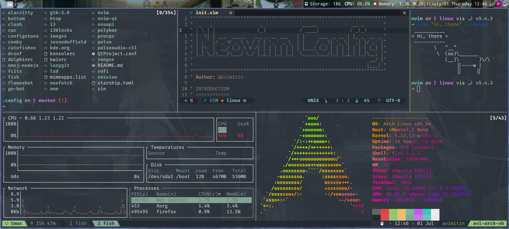

# MY DOTFILE



Try it: `git clone https://github.com/Avimitin/dotfile.git .config`

## Dependency

| Software             | Why                          |
| ---                  | ---                          |
| tmux                 | Terminal Pane                |
| neovim(latest build) | Editor                       |
| lazygit              | Git TUI                      |
| exa                  | Another ls                   |
| git-delta            | fancy git diff               |
| picom                | Gaussain blur                |
| nnn                  | file explorer                |
| fish                 | Shell for 90s                |
| alacritty            | Terminal with GPU accelerate |
| acpi                 | battery information          |
| sysstat              | CPU information              |
| starship             | fancy promt                  |
| zoxide               | easy jump                    |
| nm-applet            | network manager              |
| feh                  | background image             |

## Font

You will need to install [Jetbrains Mono](https://github.com/ryanoasis/nerd-fonts/releases)

## Environment setting

### fcitx

```bash
# running fcitx
export GTK_IM_MODULE=fcitx
export QT_IM_MODULE=fcitx
export XMODIFIERS="@im=fcitx"
```

### picom

```
# picom
picom --experimental-backends --backend glx -b -c
```

