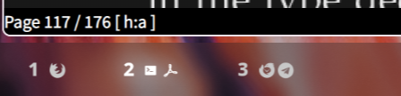
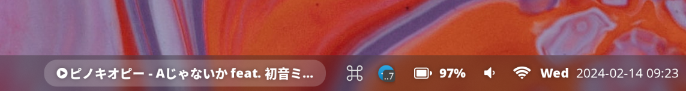

# How to activate a config

Install nix, then add home-manager channel:

```bash
# Go to project root, where flake.nix located
cd ..
./hm -u switch homelab
```

## Show case

- Neovim: [nvim](https://github.com/Avimitin/nvim)
- Waybar:

| Left Component                             | Right Component                              |
|--------------------------------------------|----------------------------------------------|
|  |  |
