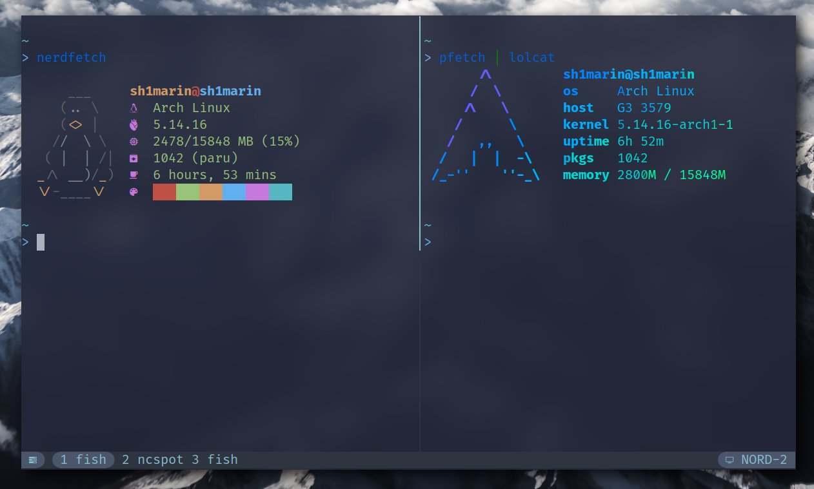
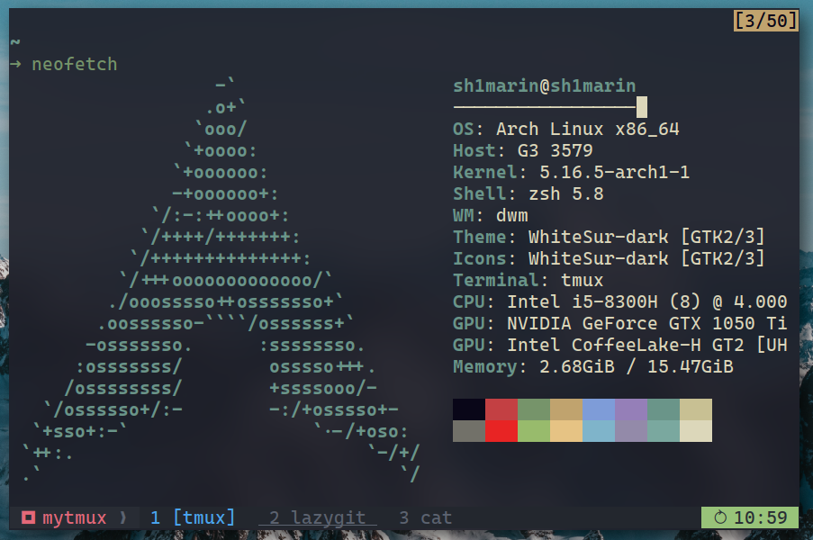

# tmux

*Nord theme*


*No nerdfont version*


## Install

First of all, you need a nerd font for icons:
[nerd font](https://nerdfonts.com/)

Then clone the repo and copy the config file to your home path.

```bash
git clone https://github.com/Avimitin/tmux

# nord theme with nerd font ver
cp tmux/.tmux.conf ~/

# no nerd font version
cp tmux/.tmux.conf.min ~/.tmux.conf
```

## Keys

* prefix:                <kbd>Ctrl-a</kbd>
* next window:           <kbd>Ctrl-l</kbd>
* previous window:       <kbd>Ctrl-h</kbd>
* move next:             <kbd>Alt-l</kbd>
* move previous:         <kbd>Alt-h</kbd>
* move up:               <kbd>Prefix k</kbd>
* move down:             <kbd>Prefix j</kbd>
* new window:            <kbd>Prefix Ctrl-c</kbd> 
* split horizontal pane: <kbd>Prefix -</kbd>
* split vertical pane:   <kbd>Prefix _ </kbd>
* toggle scrolling:      <kbd>Prefix [</kbd>
* copy mode:             <kbd>Prefix Enter</kbd>
* switch to last window: <kbd>Prefix Tab</kbd>
* swap panel:            <kbd>Prefix < or ></kbd>

## Credit

Keymap is copied from
[gpakosz/.tmux](https://github.com/gpakosz/.tmux).

Some setting is copied from
[reorx/dotfiles](https://github.com/reorx/dotfiles/blob/master/tmux.conf).

Colorscheme is inspired by
[wfxr/tmux-power](https://github.com/wfxr/tmux-power).

Nord Colorscheme is copied from:
[nordtheme](https://www.nordtheme.com/docs/colors-and-palettes)

## License

MIT License
