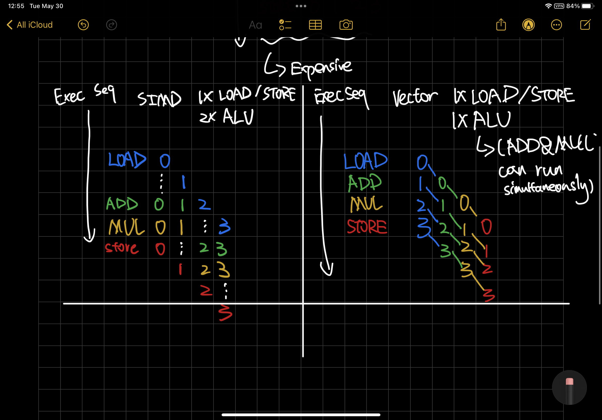

# Vector Processor（向量处理器）

Vector Processor, 或者说 Array Processor，是一个实现了对 **大型的一维数组** 高效操作的指令集的 CPU。
这里，一维数组通常被称作向量。这是一个和标量处理器(Scalar Processor)对应的概念，
其一次只操作或计算一个实数或者浮点数。同时也应该将向量处理器与支持 SIMD （单指令多数据流）的
标量处理器区别开来。

现代的大部分 CPU 都支持定长的 SIMD 指令。乍一看，这些处理器可以被认为是向量处理的一种形式，
因为它们对多个（向量的、明确长度的）数据集进行操作，并借用了向量处理器的特征。
然而，根据定义，增加SIMD本身并不能使一个处理器成为一个真正的向量处理器，因为SIMD是固定长度的，
而向量是可变的。

* 纯 SIMD 处理器：Intel x86 MMX, SSE, AVX, ARM NEON...
* 带预测 SIMD 处理器：一类自带独立判断是否需要执行计算的处理器，其带有固定宽度的 SIMD ALU（逻辑计算单元），
但其允许局部控制激活单元来提供一个表面上可变长度的向量。比如 ARM SVE2, AVX-512
* 纯向量处理器：Cray-1, RISC-V RVV

SIMD 处理器的操作数虽然通常是个向量，但不能将 SIMD 处理器和向量处理器混淆。
向量处理器和带 SIMD 的处理器的最重要区别是，向量处理器从定义和设计上，都是在可变长度的向量数据上
计算的。向量处理器的 ISA 会有设置向量长度的指令，比如 rvv 的 setvl 指令，同时还有迭代和 reduction。
除此之外，通过 vector chaining 的技术，向量处理器可以在更慢的机器上，获得与 SIMD 吞吐量和延迟相当的性能表现。

考虑一个SIMD处理器和一个向量处理器在计算和处理4个64位元素，做了一系列的 LOAD、ADD、MULTIPLY和STORE 操作。
如果SIMD的设定宽度是4，那么SIMD处理器在进入ADD之前必须完全加载四个元素，在进入MULTIPLY之前必须完成所有的ADD，
同样在开始STORE之前必须完成所有的MULTIPLY。这是由定义和设计决定的。

要在数据宽度为 4 的处理器上内同时进行64位加载和64位存储，在硬件上是非常昂贵的（需要到内存的256位的 data path）。
拥有4个64位ALU，特别是MULTIPLY，也是如此。为了降低操作的成本，一个SIMD处理器会设计成有1个64位宽的LOAD，
1个64位宽的STORE，以及2个64位宽的ALU。

如图所示，降低成本以后，即使使用指令并行，执行效率相对依旧变低了。
两个 ALU 需要等两次 LOAD 执行完毕之后才能开始计算，而 STORE 1 需要等 STORE 0 结束之后才能执行。
如果没有指令并行的支持，那么操作的时间就更长了，因为 LOAD 可能不会与第一个ADD同时执行，等等。
如果只有4个64位的SIMD ALU，那么只有当所有四个LOAD都完成后，SIMD 操作才能开始，只有当所有ALU操作都完成后，STORE才能开始。

而如图右边所示，一个向量处理器，即使只有一个 LOAD 一个 STORE 和一个 ALU （支持 ADD/MUL 并行），而且不使用指令并行技术，
由于可以 vector chaining，寄存器内的元素可以直接被使用，这个向量寄存器依旧能比 SIMD 更快的执行完毕。
