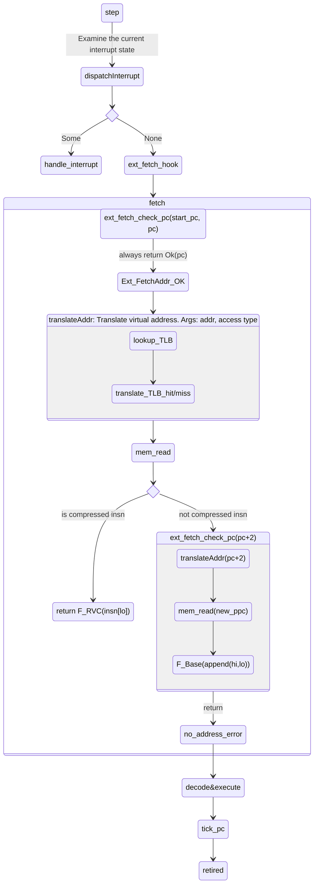

### sail

* Manual: <https://alasdair.github.io/manual.html#_introduction>

### RVFI-DII

RVFI-DII (Risc-V Formal Interface - Direct Instruction Injection) is based on
RVFI from Claire Wolf used for formal verification of RISC-V implementations.
It adds an instruction trace format and standardises a packet format for the
execution trace.

<https://github.com/CTSRD-CHERI/TestRIG/blob/master/RVFI-DII.md>

### HTIF

HTIF (Host-Target Interface) is an interface used in RISC-V systems for
communication between a host computer and a RISC-V target device. Here are the
key points about HTIF:

1. Purpose: HTIF allows communication between a host computer (typically
running a front-end server) and a RISC-V target device or simulator[1][5].

2. Functionality: - It is used for serial output and general device access on
RISC-V systems[5]. - HTIF can be used to load programs into RISC-V memory,
control execution, and handle I/O[1][6].

3. Implementation: - RISC-V CPUs expose two special registers called `mtohost`
and `mfromhost` for HTIF communication[5]. - Commands are written to the
`mtohost` register and data is received from the `mfromhost` register[5]. -
When data is available, an HTIF-interrupt is raised by the CPU[5].

4. Usage: - In simulators like Spike, HTIF is used to load binaries, control
execution, and handle I/O[1][6]. - On real hardware (like FPGA
implementations), HTIF can be connected to a front-end server running on a
separate processor[5].

5. System calls: HTIF can be used to implement system calls, allowing RISC-V
programs to interact with the host system[7].

6. Debugging: HTIF is often used for debugging purposes, especially in
emulators and simulators[5].

7. Future plans: HTIF is considered a non-standard tool specific to Berkeley
RISC-V implementations. It is expected to be replaced by more standardized
interfaces as the RISC-V ecosystem matures[1].

8. Documentation: HTIF is not well-documented, as it's primarily an internal
tool used in Berkeley RISC-V implementations[1][6].

It's worth noting that while HTIF has been widely used in RISC-V development
and testing, it is gradually being phased out in favor of more standardized
interfaces as RISC-V hardware and software ecosystems evolve.

Citations:
[1] https://riscv.org/technical/specifications/
[2] https://llvm.org/docs/RISCVUsage.html
[3] https://en.wikipedia.org/wiki/RISC-V
[4] https://docs.rtems.org/branches/master/user/bsps/bsps-riscv.html
[5] https://genode.org/documentation/articles/riscv
[6] https://github.com/ucb-bar/riscv-sodor/issues/13
[7] https://github.com/ucb-bar/libgloss-htif

## Sail model C emulator init step

- riscv_sim.c
  * main
  * preinit_sail: execute `model_init` function impl in sail
  * if rvfi-dii -> init socket
  * else load_sail (load elf to corresponding memory address)
  * init_spike (if spike is enable. spike will be used for stepping instruction too, tv_step is executed after sail)
  * init_sail with ELF entry address
    * zinit_model (Defined in sail)
    * if RVFI_DII, init ram, rom, clint
    * init reset vector address (the `reset_vec` here is a ROM that contains instruction sequences to init register)
    * align rom
    * set `zPC` to rom base address :QUESTION: where is `zPC` defined
  * Enter for-loop, execute run_sail (step instruction one by one)
    * if rvfi-dii is enable, read instruction from socket
    * else create `sail_int` instance as sail_step, feed `zstep` implemented at sail side.
    * if exception raised, use `goto step_exception` to exit the for loop
    * each step verify `zhtif_done` (do)
    * when instruction count equals to `rv_insns_per_tick`(configurable, default 100), trigger `ztick_clock`, `ztick_platform`

Things that we can ignore:

- RVFI
- HTIF

## Steps for sail-riscv step

